# Multinational Retail Data Centrialisation
This project aims to consolidate sales data from various sources into a centralised database for a multinational company. This system will streamline data access and analysis, extracting from formats like AWS RDS, S3 buckets, and REST APIs. The primary goal is to establish a centralised database system that consolidates the company's sales data, serving as a unified source of truth.

## Table of Contents
1. [Introduction](#introduction)
2. [Installation Instructions](#installation-instructions)
3. [Usage Instructions](#usage-instructions)
4. [File Structure](#file-structure)
5. [Breakdown](#breakdown)
6. [License](#license)

## Introduction
This multinational Retail data centralisation project is a comprehensive solution designed to streamline extraction, cleaning and querying data from multiple sources. The goal is to provide a reliable, efficient, and user-friendly tool for organised data storage and usage.

Scenario: You work for a multinational company that sells various goods across the globe. Currently, their sales data is spread across many different data sources making it not easily accessible or analysable by current members of the team. In an effort to become more data-driven, your organisation would like to make its sales data accessible from one centralised location. The first task will be to produce a system that stores the current company data in a database so that it's accessed from one centralised location and acts as a single source of truth for sales data. The database will then be queried to get up-to-date metrics for the business.

This project extracts data from the following data types before cleaning and uploading for acess and analysis.

AWS RDS database
AWS S3 bucket PDF
AWS S3 bucket CSV
AWS S3 bucket JSON
REST API JSON

## Installation Instructions
Prerequisites: Ensure that you have the necessary pre-installed software ond dependencies installed on your system.

boto3
pandas
python
Requests
SQLAlchemy
tabula_py

Clone the Repository: Clone this repository to your local machine using: git clone [repository URL]
Run the application

## Usage Instructions

To run this project, you will have to set up the following credentials and databases:

db_creds.yaml
pgdb_creds.yaml
api_creds.yaml

You should now be able to run the upload scripts to start the data centralisation process. This will intialise the data extraction and cleaning processes, after which the processed data will be uploaded in a central PostgreSQL database.

## File Structure 

data_cleaning.py: This file hosts the 'DataCleaning' class, which encompasses various methods dedicated to purifying and refining data derived from multiple sources.

database_utils.py: In this script, you'll find the 'DatabaseConnector' class. Its primary role is to establish connections and facilitate data uploads to our database system.

data_extraction.py: This script introduces the 'DataExtractor' class, a pivotal utility tool for retrieving data from a diverse array of sources. It includes functionalities for processing data from formats like CSV files, tapping into APIs, and accessing contents stored in an S3 bucket.

## Breakdown

Below is a summary of the steps taken in this projects construction.

Step 1:

Create a db_creds.yaml file containing the database credentials

Step 2:

Create a method read_db_creds this will read the credentials yaml file and return a dictionary of the credentials.

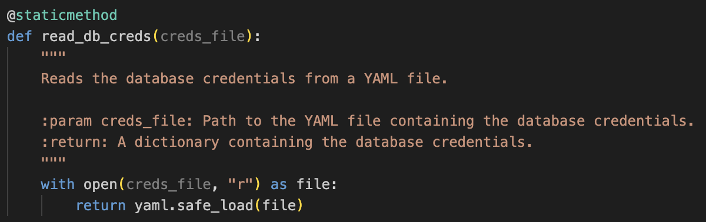

Step 3:

Now create a method init_db_engine which will read the credentials from the return of read_db_creds and initialise and return an sqlalchemy database engine.

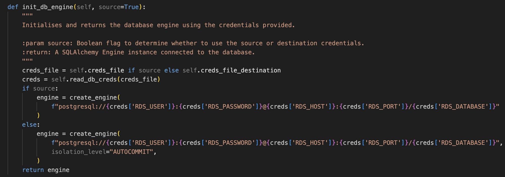

Step 4:

Using the engine from init_db_engine create a method list_db_tables to list all the tables in the database so you know which tables you can extract data from.Develop a method inside your DataExtractor class to read the data from the RDS database.

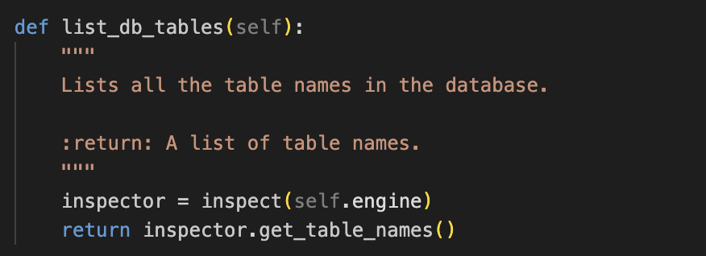

Step 5:

Develop a method called read_rds_table in your DataExtractor class which will extract the database table to a pandas DataFrame.

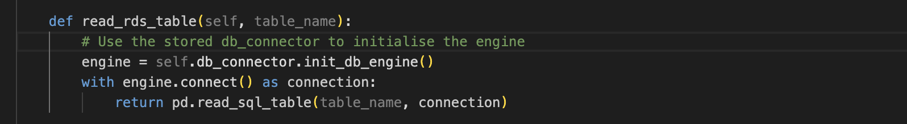

Step 6:

Create a method called clean_user_data in the DataCleaning class which will perform the cleaning of the user data.
You will need clean the user data, look out for NULL values, errors with dates, incorrectly typed values and rows filled with the wrong information.

Step 7:

Now create a method in your DatabaseConnector class called upload_to_db. This method will take in a Pandas DataFrame and table name to upload to as an argument.

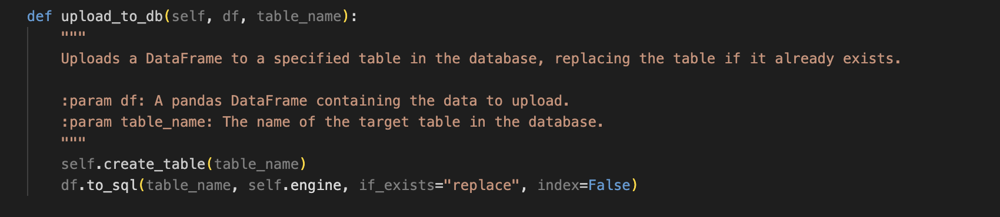

Step 8:

Once extracted and cleaned use the upload_to_db method to store the data in your sales_data database in a table named dim_users.

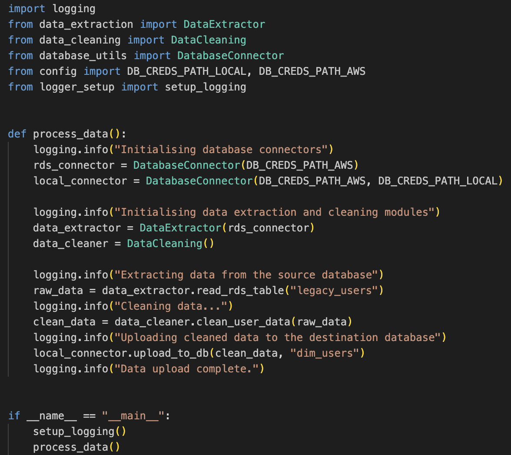

Step 9:

Install the Python package tabula-py this will help you to extract data from a pdf document.

Step 10:

Create a method in your DataExtractor class called retrieve_pdf_data, which takes in a link as an argument and returns a pandas DataFrame.Use the tabula-py Python package, imported with tabula to extract all pages from the pdf document at following link .Then return a DataFrame of the extracted data.

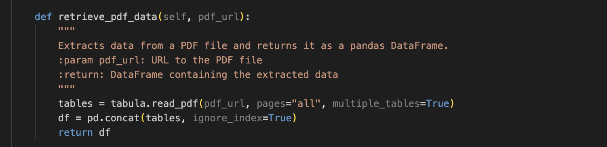

Step 11:

Create a method called clean_card_data in your DataCleaning class to clean the data to remove any erroneous values, NULL values or errors with formatting.

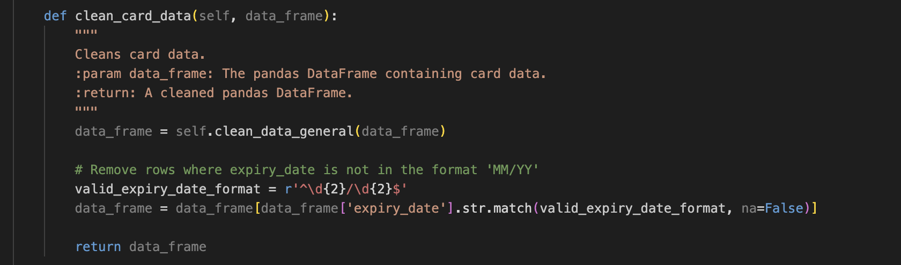

Step 12:

Once cleaned, upload the table with your upload_to_db method to the database in a table called dim_card_details.

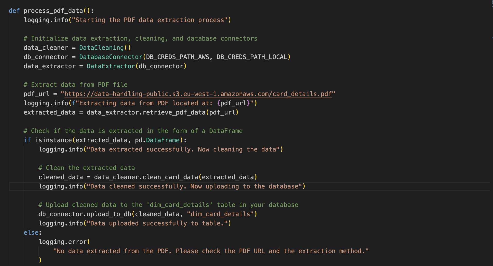

Step 13:

Create a method in your DataExtractor class called list_number_of_stores which returns the number of stores to extract. It should take in the number of stores endpoint and header dictionary as an argument.

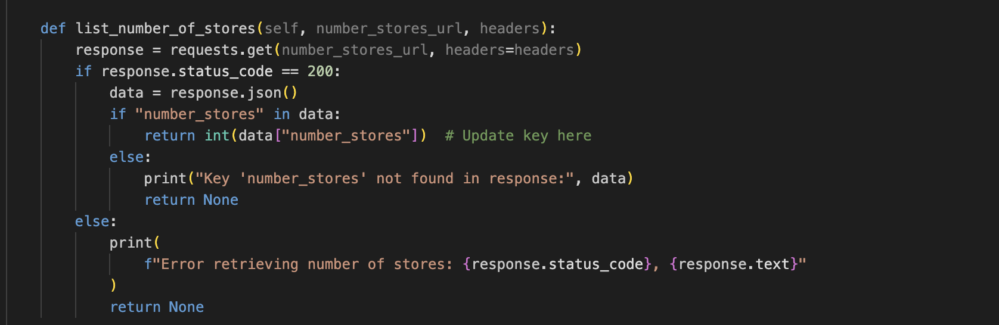

Step 14:

Now you know how many stores need to be extracted from the API.

Step 15:

Create another method retrieve_stores_data which will take the retrieve a store endpoint as an argument and extracts all the stores from the API saving them in a pandas DataFrame.

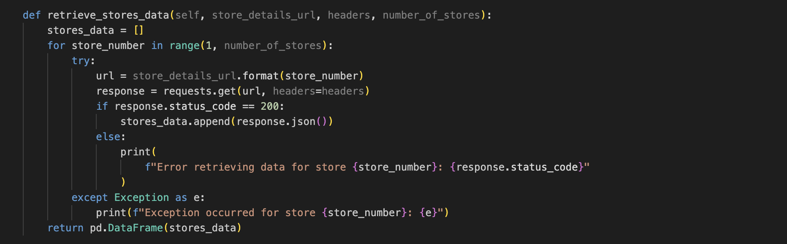

Step 16:

Create a method in the DataCleaning class called_clean_store_data which cleans the data retrieve from the API and returns a pandas DataFrame.

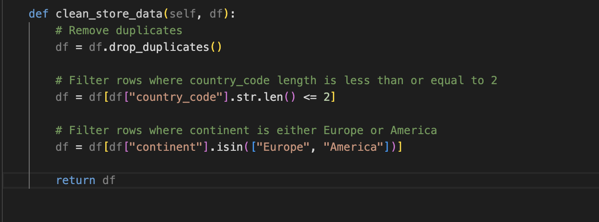

Step 17:

Upload your DataFrame to the database using the upload_to_db method storing it in the table dim_store_details.

Step 18:

Create a method in DataExtractor called extract_from_s3 which uses the boto3 package to download and extract the information returning a pandas DataFrame.
The S3 address for the products data is the following s3://data-handling-public/products.csv the method will take this address in as an argument and return the pandas DataFrame.

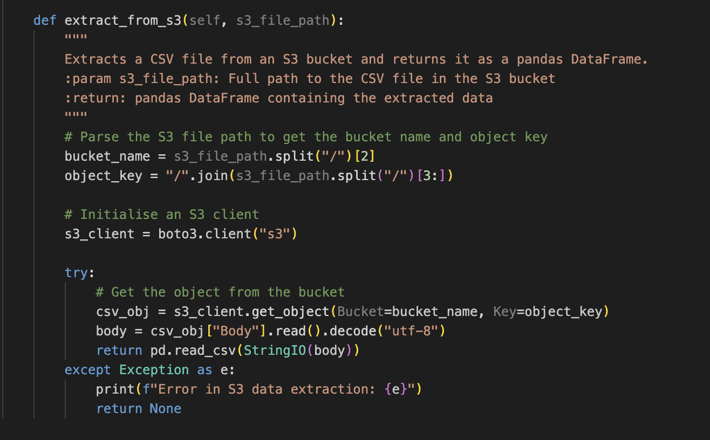

Step 19:

Create a method in the DataCleaning class called convert_product_weights this will take the products DataFrame as an argument and return the products DataFrame.If you check the weight column in the DataFrame the weights all have different units.Convert them all to a decimal value representing their weight in kg. Use a 1:1 ratio of ml to g as a rough estimate for the rows containing ml.Develop the method to clean up the weight column and remove all excess characters then represent the weights as a float.

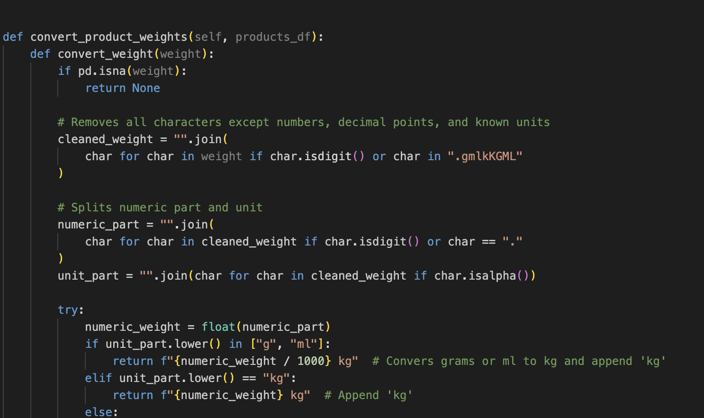

Step 20:

Now create another method called clean_products_data this method will clean the DataFrame of any additional erroneous values.

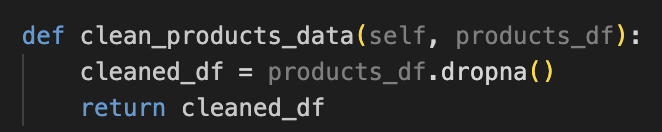

Step 21:

Once complete insert the data into the sales_data database using your upload_to_db method storing it in a table named dim_products.

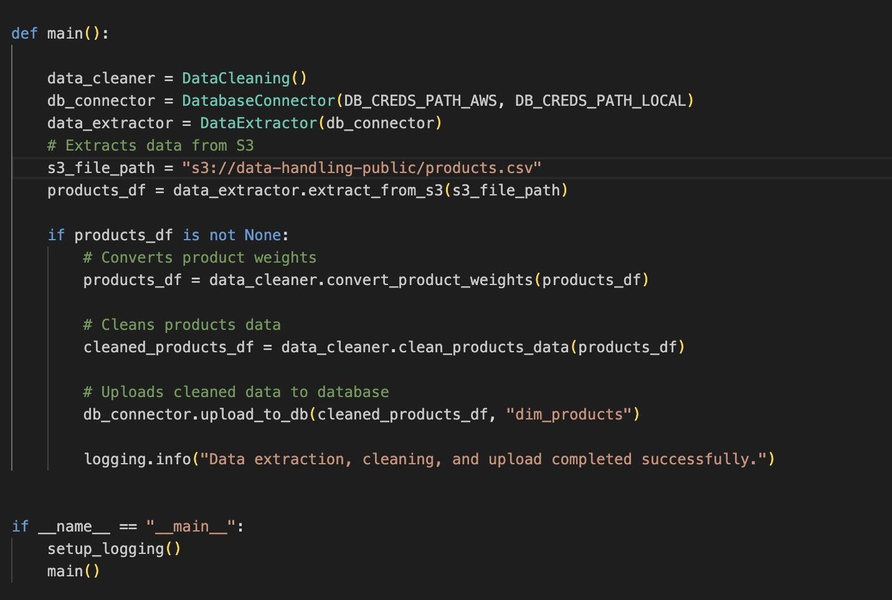

Step 22:

Using the database table listing methods you created earlier list_db_tables, list all the tables in the database to get the name of the table containing all information about the product orders.

Step 23:

Extract the orders data using the read_rds_table method you create earlier returning a pandas DataFrame.

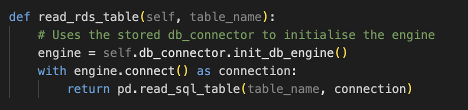

Step 24:

Create a method in DataCleaning called clean_orders_data which will clean the orders table data.

You should remove the columns, first_name, last_name and 1 to have the table in the correct form before uploading to the database.
You will see that the orders data contains column headers which are the same in other tables.
This table will act as the source of truth for your sales data and will be at the center of your star based database schema.

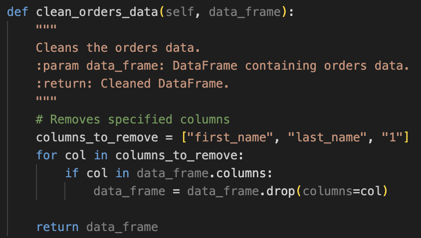

Step 25:

Once cleaned upload using the upload_to_db method and store in a table called orders_table,

Step 26:

The final source of data is a JSON file containing the details of when each sale happened, as well as related attributes.
The file is currently stored on S3. Extract the file and perform any necessary cleaning, then upload the data to the database naming the table dim_date_times.

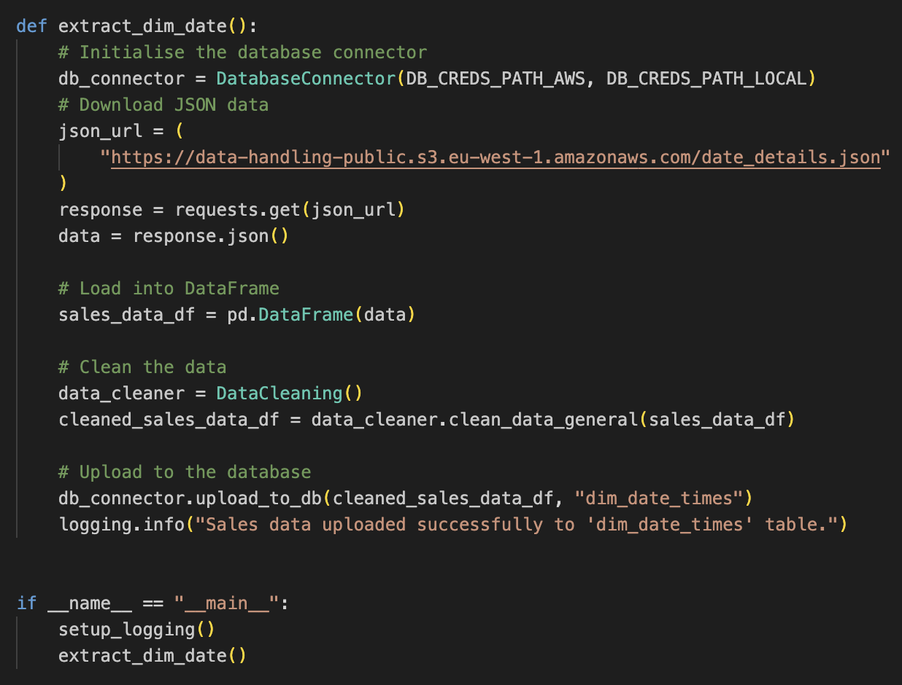

## Licence 

MIT License Copyright (c) [2023] [Kian Semnani]

Permission is hereby granted, free of charge, to any person obtaining a copy of this software and associated documentation files (the "Software"), to deal in the Software without restriction, including without limitation the rights to use, copy, modify, merge, publish, distribute, sublicense, and/or sell copies of the Software, and to permit persons to whom the Software is furnished to do so, subject to the following conditions:

The above copyright notice and this permission notice shall be included in all copies or substantial portions of the Software.

THE SOFTWARE IS PROVIDED "AS IS", WITHOUT WARRANTY OF ANY KIND, EXPRESS OR IMPLIED, INCLUDING BUT NOT LIMITED TO THE WARRANTIES OF MERCHANTABILITY, FITNESS FOR A PARTICULAR PURPOSE AND NONINFRINGEMENT. IN NO EVENT SHALL THE AUTHORS OR COPYRIGHT HOLDERS BE LIABLE FOR ANY CLAIM, DAMAGES OR OTHER LIABILITY, WHETHER IN AN ACTION OF CONTRACT, TORT OR OTHERWISE, ARISING FROM, OUT OF OR IN CONNECTION WITH THE SOFTWARE OR THE USE OR OTHER DEALINGS IN THE SOFTWARE.